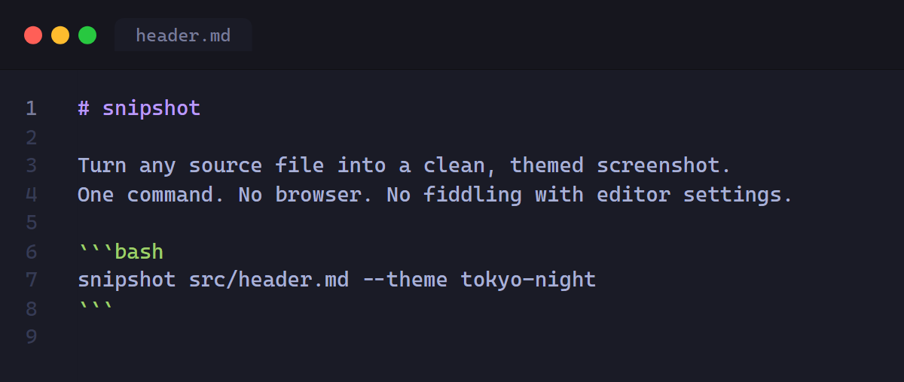

<p align="center">
  
</p>

## Requirements

- [Bun](https://bun.sh) v1.0+
- [Node.js](https://nodejs.org) (Puppeteer needs it)

## Install

```bash
git clone https://github.com/anishshobithps/snipshot
cd snipshot
bun install
bun run link
```

`bun run link` builds the project and registers the `snipshot` command globally.

## Usage

### Interactive mode

Run without arguments and snipshot walks you through every option:

```bash
snipshot
```

It scans your working directory for code files, respecting your `.gitignore` and `.ignore` if they exist. Pick a file from the list, choose a theme, set font size, padding, border radius, and an optional filename label. Press Enter to accept defaults at any step.

### Direct mode

```bash
snipshot <file> [options]
```

```
Options:
  --theme <name>           Shiki theme (default: tokyo-night)
  --font-size <n>          Font size in px (default: 14)
  --padding <n>            Outer padding in px (default: 40)
  --border-radius <n>      Corner radius in px (default: 0)
  --width <n>              Fix output width in px (disables auto-sizing)
  --height <n>             Fix output height in px (disables auto-sizing)
  --output <path>          Output PNG path (default: <filename>.png)
  --filename-label <text>  Custom label shown in the filename tab
  --no-window              Hide the macOS window chrome
  --no-filename            Hide the filename tab
  --list-themes            Print all available themes and exit
  --list-languages         Print all supported languages and exit
  -i, --interactive        Force interactive mode
  --help                   Show help
```

### Examples

```bash
# Screenshot with defaults
snipshot src/index.ts

# Different theme and font size
snipshot app.py --theme catppuccin-mocha --font-size 16

# No window chrome, custom output path
snipshot main.rs --no-window --output hero.png

# Custom filename label in the tab
snipshot src/index.ts --filename-label "✨ index.ts"

# Fixed size (e.g. for social/OG images)
snipshot README.md --width 1280 --height 640 --output cover.png

# See all themes
snipshot --list-themes
```

## Themes

snipshot supports 235 languages and 65 themes, all from [Shiki](https://shiki.style). The supported file extensions are read directly from Shiki's language registry at startup, so there's no hardcoded list to maintain. A few themes worth trying:

| Dark               | Light              |
| ------------------ | ------------------ |
| `tokyo-night`      | `github-light`     |
| `catppuccin-mocha` | `catppuccin-latte` |
| `rose-pine`        | `rose-pine-dawn`   |
| `dracula`          | `min-light`        |
| `github-dark`      | `solarized-light`  |

Run `snipshot --list-themes` to see all of them.

## How it works

1. **File discovery.** snipshot reads your `.gitignore` and `.ignore` at startup, then walks the working directory skipping anything matched. Files are included if their extension maps to a language id or alias in Shiki's registry.
2. **Theme resolution.** `shiki-bridge` converts the Shiki theme into the token and color format Monaco expects, keeping foreground colors and font styles intact.
3. **Headless render.** Puppeteer opens a headless browser and loads a self-contained HTML page with Monaco Editor, your code, and the converted theme.
4. **Precise sizing.** snipshot reads Monaco's actual content height through the editor API and resizes the container to fit, with no extra whitespace. Width follows the longest line. Pass `--width` and `--height` to set an exact pixel size.
5. **Screenshot.** Puppeteer captures the `#capture` element at 2x device pixel ratio and writes the PNG. Fixed-size mode uses 1x so the output matches the requested dimensions exactly.
